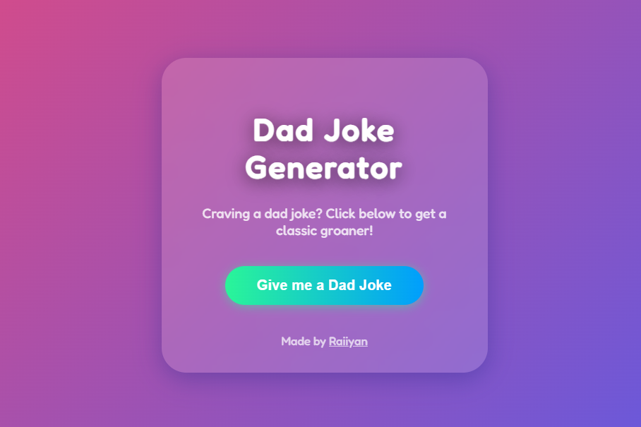
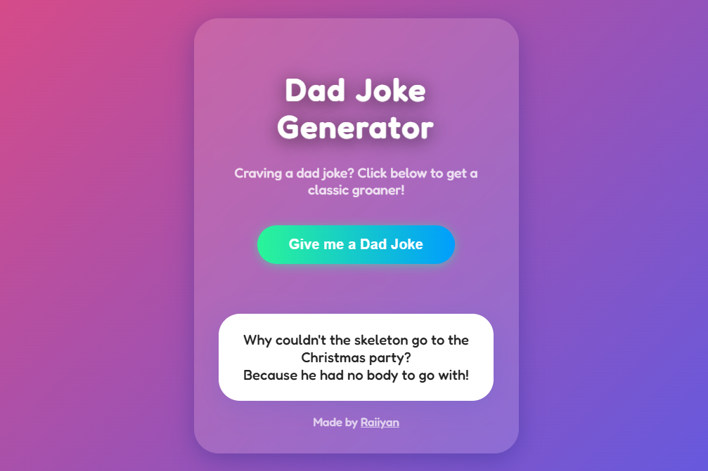

# Dad Joke Generator 😁

A fun, responsive web app that delivers a fresh dad joke at the tap of a button. Built with React, featuring a playful design, mobile-first responsiveness, and a memorable "dad" mascot logo.




## 🚀 Features

- **Random Dad Jokes:** Fetches classic dad jokes from [JokeAPI](https://jokeapi.dev/).
- **Responsive Design:** Looks great on mobile and desktop.
- **Playful UI:** Funky gradients, animated transitions, and a custom dad logo.
- **PWA Ready:** Add to your home screen and enjoy offline support (if enabled).
- **Accessible:** High-contrast text and easy navigation.

## 📦 Getting Started

### 1. Clone & Install

```bash
git clone https://github.com/raiiyan/dad-joke-generator.git
cd dad-joke-generator
npm install
```

### 2. Run Locally

```bash
npm start
```

Open [http://localhost:3000](http://localhost:3000) in your browser.

### 3. Build for Production

```bash
npm run build
```

## 🛠️ Project Structure

```
dad-joke-generator/
├── public/
│   ├── index.html
│   ├── manifest.json
│   ├── favicon.ico (optional)
│   └── logo192.png, logo512.png, ...
├── src/
│   ├── App.jsx
│   ├── App.css
│   ├── Logo.jsx
│   └── ...
├── package.json
└── README.md
```

## 🌐 Live Demo

> [Dad Joke Generator Live](https://dad-joke-generator.vercel.app/)  
> _(Replace with your actual deployment link!)_

## ⚙️ Configuration

- **API:** Uses [JokeAPI](https://jokeapi.dev/) (no API key needed).
- **Manifest:** See `public/manifest.json` for PWA settings.
- **Favicon:** Remove or replace `favicon.ico` in `public/` as desired.

## 🤲 Contributing

PRs are welcome!

- Fork the repo
- Create a branch
- Submit your pull request

## 📄 License

MIT

---

**Made with ❤️ and 😜 by [Raiiyan Hossain](https://raiyan-hossain.vercel.app/)**
